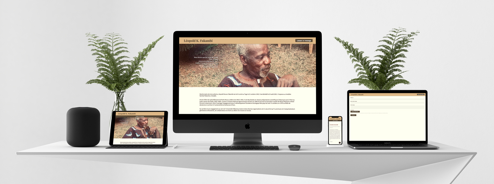

# &#x26B0; LEOPOLD FAKAMBI  
## A TRIBUTE WEBSITE USING A CUSTOM THEME. 

[>>> VISIT THE WEBSITE](http://leopold.fakambi.net)

&nbsp;

## KEYPOINTS
- ✅ Made with Wordpress and ❤️ .
- ✅ Content redaction and child theme customization (HTML, CSS, Javascript). 
- ✅ Fully responsive (custom media queries).
- ✅ 1 page design
- ✅ Front-end submission form. 

&nbsp;

### 🔖 The website
________________________________________________________________
An acquaintance whose father had died was looking for a solution to gather online messages of support sent to the family. Most of the existing solutions were too corportate and not very focused on the sole listing of the messages.
I volunteered to quickly set up a responsive Wordpress site that would accept messages via a form, which could be moderated beforehand and then displayed on a single page. 

&nbsp;

## Front-end Librairies used 
- [GSAP](http://www.w3schools.com/jquery/jquery_ref_ajax.asp) - GSAP simplifies HTML document traversing, event handling, animating, and Ajax interactions for rapid web development.
- 
## Next steps (if required by the client)
- Content caching for faster page loads. 
- Design improvements. 
- Feature to design and print the tribute messages. 

 Made with ❤️ by [Nicolas HODEE](https://www.nicolashodee.com/) - All rights reserved. 

